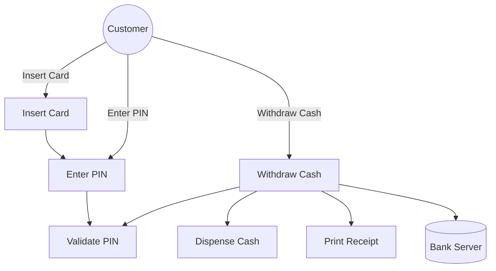
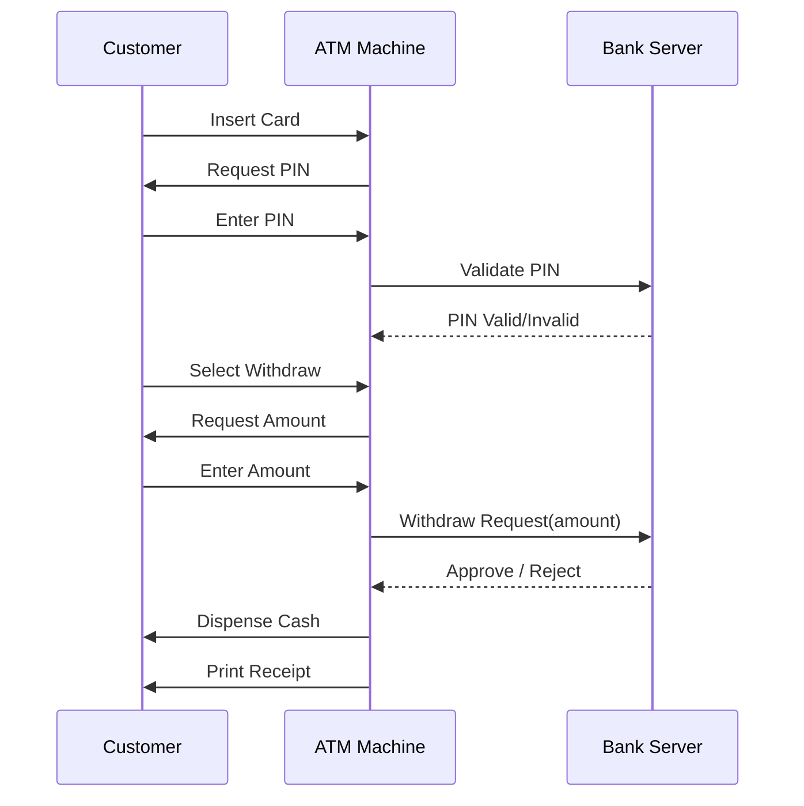

# Lab 03 – UML Thiết kế (Use Case & Sequence)

## Use Case: Withdraw Cash
Mô tả quy trình khách hàng rút tiền từ ATM.

## Sequence: Withdraw Cash
Mô tả chi tiết luồng thông điệp giữa Customer, ATM và Bank Server.

## Giải thích
- Customer: người thao tác trực tiếp.
- ATM: trung gian nhận yêu cầu và giao tiếp với hệ thống ngân hàng.
- Bank Server: xác thực và xử lý giao dịch.