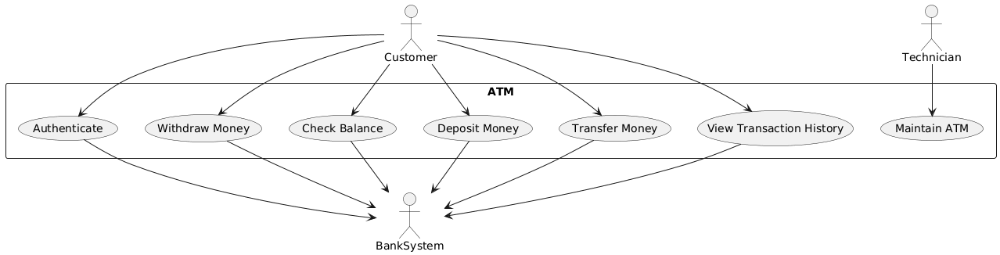

# Software Engineering Project – Lab 02

## Actors
- Customer
- Bank System
- Technician

## 2. Use Case Diagram

## Use cases description:

Use Case 1: Withdraw Money

- Actor: Customer
- Mô tả: Khách hàng rút tiền từ tài khoản qua ATM.
- Luồng chính:

    - Khách hàng chèn thẻ, nhập PIN hợp lệ.
    - Chọn chức năng “Withdraw”.
    - Nhập số tiền muốn rút.
    - ATM gửi yêu cầu tới BankSystem.
    - Nếu đủ tiền, ATM nhả tiền + in biên lai.
    - Hệ thống cập nhật số dư.

- Ngoại lệ:

    - PIN sai → báo lỗi.
    - Số dư không đủ → từ chối giao dịch.
    - ATM hết tiền → báo lỗi.

Use Case 2: Check Balance

- Actor: Customer
- Mô tả: Khách hàng kiểm tra số dư tài khoản.
- Luồng chính:

    - Khách hàng xác thực bằng thẻ + PIN.
    - Chọn chức năng “Check Balance”.
    - ATM truy vấn BankSystem.
    - ATM hiển thị số dư trên màn hình hoặc in biên lai.

- Ngoại lệ:
    - PIN sai → báo lỗi.
    - Lỗi kết nối BankSystem → ATM báo “Service unavailable”.